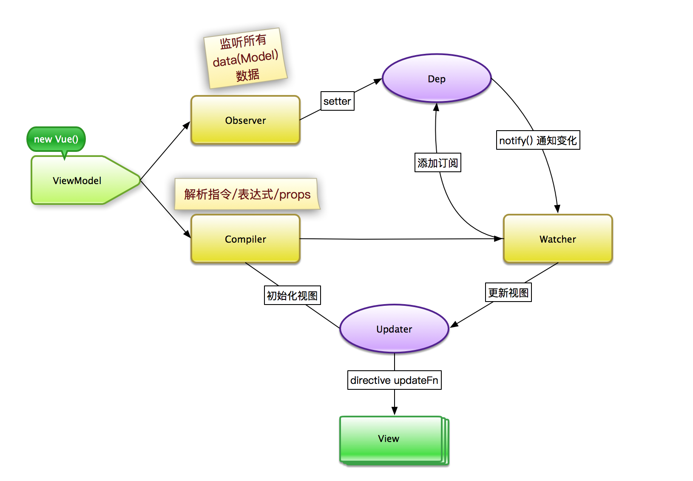
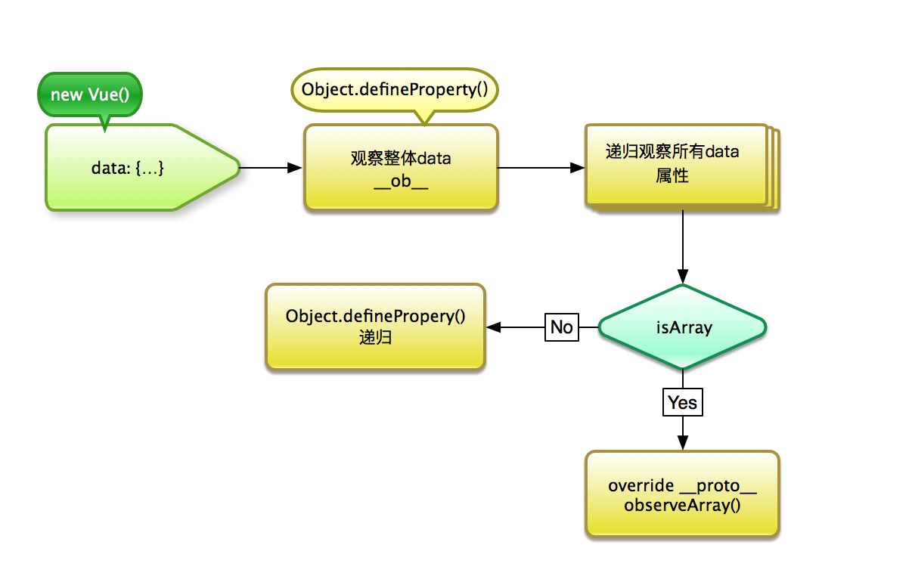
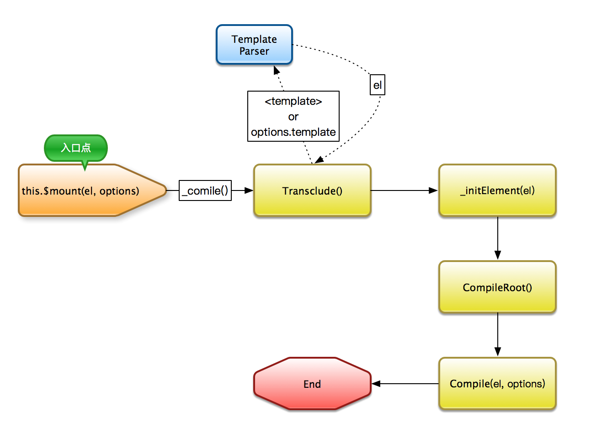
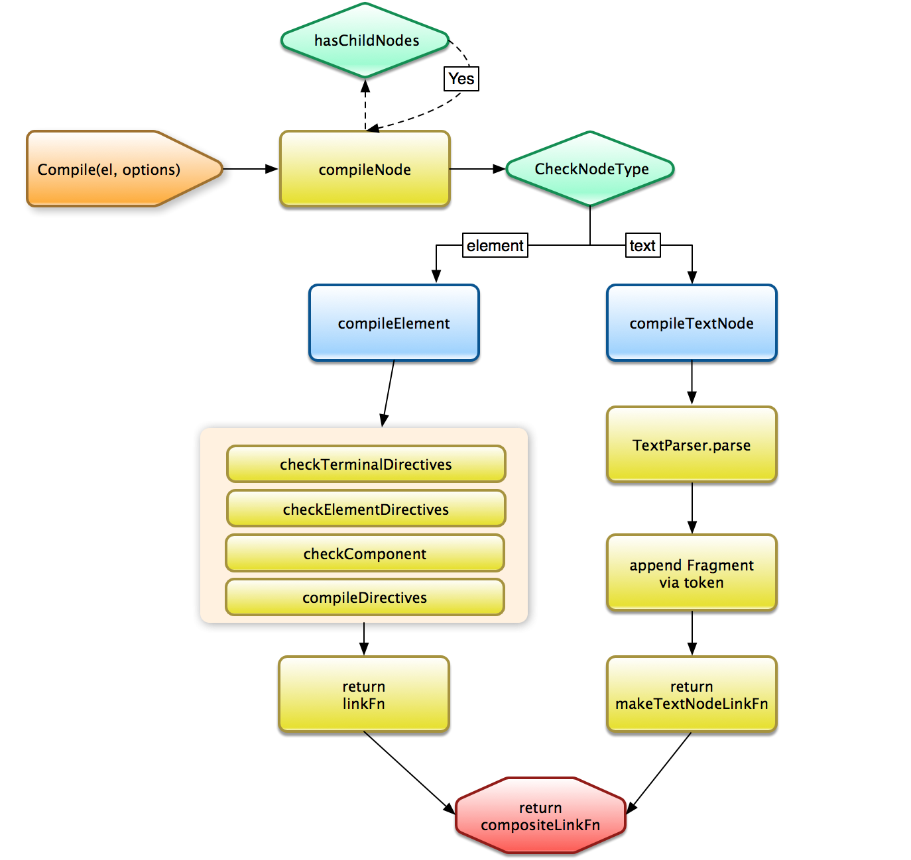
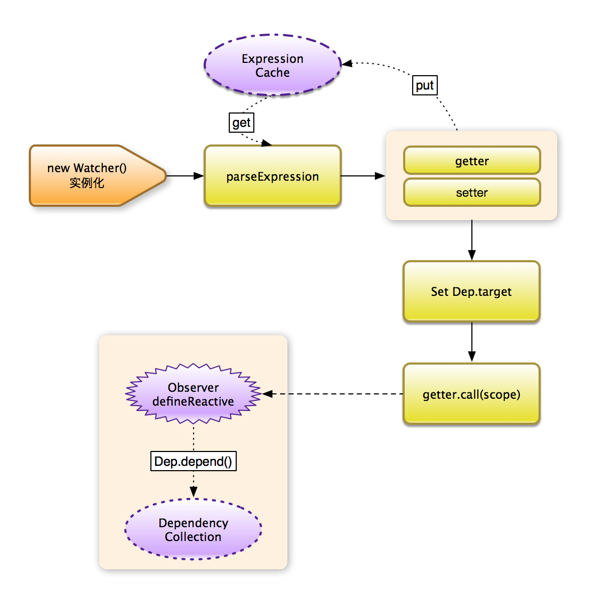
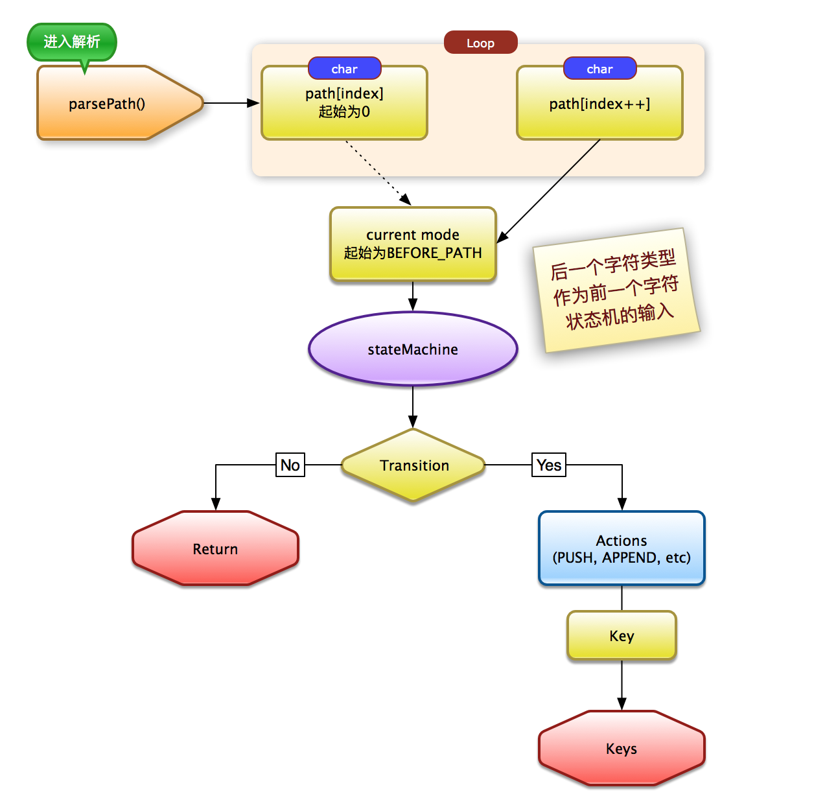
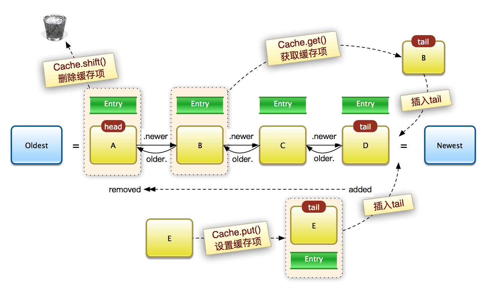

## 背景

`Vue.js` 是一个轻量级的前端 `MVVM` 框架，专注于web视图(View)层的开发 。

自2013年以来，`Vue.js` 通过其可扩展的数据绑定机制、极低的上手成本、简洁明了的API、高效完善的组件化设计等特性，吸引了越来越多的开发者。在github上已经有30,000+ star，且不断在增长；在国内外都有广泛的应用，社区和配套工具也在不断完善，影响力日益扩大，与 `React` 、`AngularJS` 这种「世界级框架」几乎平起平坐。 

外卖的FE同学比较早（0.10.x版本）就引入了 `Vue.js` 进行业务开发，经过一年多的实践，积累了一定的理解。在此基础上，我们希望去更深入地了解 `Vue.js` , 而不是一直停留在表面。所以「阅读源码」成为了一项课外任务。

我个人从9月份开始阅读Vue的源码，陆陆续续看了2个月，[这里](https://github.com/clancyz/vue-learning-notes)是我的源码学习笔记。本篇文章希望从 `Vue.js`  1.0版本的设计和实现为主线，阐述自己阅读源码的一些心得体会。

## 前端为什么需要有MVVM框架？

前端刀耕火种的历史在这里就不赘述，在`jquery` 等DOM操作库大行其道的年代，主要的开发痛点集中于：

- 当数据更新时，需要开发者主动地使用 `DOM API` 操作DOM；当DOM发生变化时，需要开发者去主动获取DOM的数据，把数据同步或提交；
- 同样的数据映射到不同的视图时，需要新的一套DOM操作，复用性低；
- 大量的DOM操作使得业务逻辑繁琐冗长，代码的可维护性差。

于是，问题的聚焦点就在于：

- 业务逻辑应该专注在操作数据（Model），更新DOM不希望有大量的显式操作。
- 在数据和视图间做到同步（数据绑定和更新监听），不需要人为干预。
- 同样的数据可以方便地对应多个视图。

此外，还应该做到的一些特性：

- 方便地实现视图逻辑（声明式或命令式）;
- 方便地创建和连接、复用组件;
- 管理状态和路由。

MVVM框架可以很好地解决以上问题。通过 `ViewModel` 对 `View` 和 `Model` 进行桥接，而`Model` 和 `ViewModel` 之间的交互是双向的，`View` 数据的变化会同步到 `Model` 中，`Model` 中的数据变化也会立即反应到 `View` 上，即我们通常所说的「双向绑定」。这是不需要人为干涉的，所以开发者只需要关注业务逻辑，其他的DOM操作、状态维护等都由MVVM框架来实现。

## Vue.js的绑定设计思路

根据上面篇幅的描述，MVVM框架工作的重中之重是建立 `View` 和 `Model` 之间的关系。也就是「绑定」。官方文档的附图说明了这一点：


从上图，只能得到一些基(cu)础(qian)的认识：

- `Model`是一个 `POJO` 对象，即简单javascript对象。
- `View` 通过 `DOM Listener` 和 `Model` 建立绑定关系。
- `Model` 通过 `Directives(指令)`，如 `{{a}}` , `v-text="a"` 与 `View` 建立绑定关系。

而实际上要做的工作还是很多的：

1. 让 `Model` 中的数据做到 `Reactive` ，即在状态变更（数据变化）时，系统能做出响应。
2. `Directives(指令)` 混杂在一个html片段(fragment，或者你可以理解就是Vue实例中的 `template` )中，需要正确解析指令和表达式(expression)，不同的指令需要对应不同的DOM更新方式，最易理解的例子就是 `v-if` 和 `v-show` ；
3. `Model` 的更新触发指令的视图更新需要有一定的机制来保证；
4. 在 `DOM Listener` 这块，需要抹平不同浏览器的差异。

`Vue.js` 在实现「绑定」方面，为所有的指令(directives)都约定了 `bind` 和 `update` 方法，即：

- 解析完指令后，应该如何绑定数据
- 数据更新时，怎样更新DOM

`Vue.js` 的解决方案中，提出了几个核心的概念：

- `Observer` :  数据观察者，对所有 `Model` 数据进行 `defineReactive`，即使所有 `Model` 数据在数据变更时，可以通知数据订阅者。
- `Watcher` : 订阅者，订阅并收到所有 `Model` 变化的通知，执行对应的指令（表达式）绑定函数
- `Dep` : 消息订阅器，用于收集 `Watcher` , 数据变化时，通知订阅者进行更新。
- `Compiler` : 模板解析器，可对模板中的指令、表达式、属性(props)进行解析，为视图绑定相应的更新函数。

可见这里面的核心思想是大家（特别FE同学）都很熟悉的「观察者模式」。总体的设计思路如下：



回到刚才说的 `bind` 与 `update`，我们看看上述概念是如何工作的：

1. 在初始化视图，即绑定阶段，`Observer` 获取 `new Vue()` 中的data数据，通过`Object.defineProperty` 赋予 `getter` 和 `setter` ; 对于数组 形式的数据，通过劫持某些方法让数组在变动时也能得到通知。另外，`Compiler` 对DOM节点指令进行扫描和解析，并订阅 `Watcher` 来更新视图。`Watcher` 在 消息订阅器 `Dep` 中进行管理。
2. 在更新阶段，当数据变更时，会触发 `setter` 函数，立即会触发相应的通知, 开始遍历所有订阅者，调用其指令的`update`方法，进行视图更新。

OK，下面我们继续深入看三个「核心点」，即 `Observer`, `Compiler`, `Watcher` 的实现原理。

## 数据观察者 `Observer` 的实现原理

前面提到，`Observer` 的核心是对 `Model(data)` 中的数据进行 `defineReactive`。

这里的实现如下：



`Vue.js` 在初始化data时，会先将data中的所有属性代理到Vue实例下（方便使用 `this` 关键字来访问），然后即调用 `Observer` 来进行数据观察。 

`Observer`会先将所有 `data` 中的属性进行整体观察，定义一个属性`__ob__` ，进行`Object.defineProperty`，即为 `data` 本身添加观察器。

同样，对于data中的每个属性也会使用 `__ob__` 为每个属性本身添加观察器。

同理，当定义了类似如下的属性值为`POJO`对象时，会去递归地  `Object.defineProperty` ; 

```javascript
{
 data: {
    a: {
        b: 'c'
      }
    }，
    d: [1,2,3]
 }
```

那么，当定义的属性值为数组时，在数组本身通过方法变化时，也需要监听数组的改变。

通过javascript操作数组的变化无外乎以下几种方式：

- 通过 `push` , `pop` 等数组原生方法进行改变；
- 通过length属性进行改变，如 `arr.length = 0`；
- 通过角标赋值, 如 `arr[0] = 1` 。

对于数组原生的方法，我们需要在使用这些方法时同时触发事件，让系统知道这个数组改变了。那么，我们通常会想到去「劫持」数组本身的方法。但是显然，我们不能直接去覆写 `Array.prototype` , 这样的全局覆写显然会对其他不需要响应式数据的数组操作产生影响。

`Vue.js` 的思路在于，当监测到一个data属性值是`Array`时，去覆写这个属性值数组的 `__proto__` 属性，即只覆写响应式数据的原型变量。核心实现如下：


```js
function Observer (value) {
  this.value = value
  this.dep = new Dep()
  _.define(value, '__ob__', this)
  // 如果判断当前值是Array, 进行劫持操作
  if (_.isArray(value)) {
    var augment = _.hasProto
      ? protoAugment
      : copyAugment
    // 在这里，arrayMethods是进行了劫持操作后的数组原型
    // augment的作用即是覆写原型方法
    augment(value, arrayMethods, arrayKeys)
    this.observeArray(value)
  } else {
    // 递归地defineProperty
    this.walk(value)
  }
}
```

对于直接改变数组length来修改数组、角标赋值，显然不能直接劫持。这时一种实现方式是把原生的 `Array` 做上层包装，变成一个`Array like Object`, 再在这里面进行`defineProperty`， 这样可以搞定length和角标赋值。但是这样做的弊端是，每次在使用数组时都需要显式去调用这个对象，如：

```
var a = new ObservableArray([1, 2, 3, 4]);
```

这样显然增加了开发者上手成本，而且改变length可以通过`splice`来实现；所以 `Vue.js` 并没有实现此功能，是一种正确的取舍。

对于角标赋值，还是有一定的使用场景，所以 `Vue.js` 扩展了 `$set` 和 `$remove` 方法来实现。
这两种方法实质还是在使用可被劫持的 `splice`，而被劫持的方法可以触发视图更新。

```js
example1.items[0] = { childMsg: 'Changed!'} // 不能触发视图更新
example1.items.$set(0, { childMsg: 'Changed!'}) // 可以触发视图更新
```


> **扩展**
> - 监测Object对象的改变，有一个提案期的 `Object.observe()` 方法，但现在已经被浏览器标准废弃，各浏览器均不再支持。同样有一个非标准的监视方法`Object.watch()` 被`Firefox` 支持，但不具备通用性。
> - 监测数组对象的改变，同样有一个提案性的Array.observe()。它不仅能监视数组方法，还可以监视角标赋值等变化。但是这个提案也已经被废弃。
> - 理论上，使用 `ES6` 的 `Proxy` 对象也可以进行 `get` 和 `set` 的拦截, 但浏览器支持情况并不好，实用性不高。
> - 所以，当前的条件下 `Object.defineProperty` 仍是最好的选择 -- 当然，在`IE8`及更低版本浏览器盛行的年代，基于此特性的MVVM框架就很难大规模被普及。

## 解析器Compiler的实现

`Compiler` 的作用主要是解析传入的元素 `el` 或模板 `template` ，创建对应的`DOMFragment`，提取指令(directive)并执行指令相关方法，并对每个指令生成Watcher。

主要的入口点是挂载在Vue.prototype下的 `_compile` 方法（实际内容在instance/lifecycle.js, Vue1.x的不同版本位置略有不同）。

整个 `_compile` 方法的流程如下：



首先执行 `transclude()` , 实际是在处理template标签或 `options.template` 字符串，将其解析为`DOMFragment`, 拿到 `el` 对象。
其次执行`_initElement(el)`, 将拿到的`el`对象进行实例挂载。
接着是`CompileRoot(el, options)` ，解析当前根实例DOM上的属性(attrs);
然后执行`Compile(el, options)`，解析template，返回一个`link Funtion(compositeLinkFn)`。
最后执行这个`compositeLinkFn`，创建

`Compile(el, options)` 的具体流程如下：



首先，`compile`过程的基础函数是`compileNode`, 在检测到当前节点有子节点的时候，递归地调用`compileNode`即对DOM树进行了遍历解析。
接着对节点进行判断，使用`comileElement` 或 `compileTextNode` 进行解析。

我们看到最终compile的结果return了一个`compositeLinkFn`, 这个函数的作用是把指令实例化，将指令与新建元素建立连接，并将元素替换到DOM树中。

`compositeLinkFn`会先执行通过`comileElement` 或 `compileTextNode` 产出的`Linkfn` 来创建指令对象。

在指令对象初始化时，不但调用了指令的bind, 还定义了 `this._update` 方法，并创建了 `Watcher`，把 `this._update` 方法(实际对应指令的更新方法)作为 `Watcher` 的回调函数。

这里把 `Directive` 和 `Watcher` 做了关联，当 `Watcher` 观察到指令表达式值变化时，会调用 `Directive` 实例的 `_update` 方法，最终去更新 DOM 节点。

以`compileTextNode`为例，写一段伪代码表示这个过程：

```js

// compile结束后返回此函数
function compositeLinkFn (arguments) {
  linkAndCapture()
  // 返回解绑指令函数，这里不深究。
  return makeUnlinkFn(arguments)
}

function linkAndCapture(arguments) {
  // 创建指令对象
  linkFn()
  // 遍历 directives 调用 dirs[i]._bind 方法对单个directive做一些绑定操作
  // 这里会去实例化单个指令，执行指令的bind()函数，并创建Watcher
  dirs[i]._bind()
}

// 解析TextNode节点，返回了linkFn
function compileTextNode(node) {
  // 对节点数据进行解析，生成tokens
  var tokens = textParser.parse(node.data)
  createFragment()
  // 创建token的描述，作为后续生成指令的依据
  setTokenDescriptor()
  /**
   do other things
  **/
  return linkFn(tokens, ...);
}

// linkFn遍历token,遍历执行_bindDir, 传入token描述
function linkFn () {
  tokens.forEach(function (token) {
    if (token.html) replaceHtml();
    vm._bindDir(token.discriptor)
  })
}

// 根据token描述创建指令新实例
Vue.prototype._bindDir = function (descriptor) {
  this._directives.push(new Directive(descriptor))
}


```

至此，`compiler` 的工作就结束了。


## Watcher订阅监听的实现

## Watcher的职责

在上述compiler的实现中，最后一步用于创建`Watcher`：

```js
// 为每个directive指令创建一个watcher
dirs[i]._bind()

Directive.prototype._bind = function () {
  ...
  // 创建Watcher部分
  var watcher = this._watcher = new Watcher(
    this.vm,
    this.expression,
    this._update, // callback
    {
      filters: this.filters,
      twoWay: this.twoWay,
      deep: this.deep,
      preProcess: preProcess,
      postProcess: postProcess,
      scope: this._scope
    }
  )
  ...
}


```

接收的参数是vm实例、expression表达式、 callback回调函数和相应的Watcher配置, 其中包含了上下文信息： `this._scope`。

每个指令都会有一个watcher, 实时去监控表达式的值，如果发生变化，则通知指令执行 `_update` 函数去更新对应的DOM。那么我们可以想到，watcher主要做的工作是：

- 解析表达式，如 `v-show="a.b.c > 1"` ; 表达式需要转换成函数来求值；
- 自动收集依赖。

## watcher的实现

这部分工作的实现如下：



### 使用状态机进行路径解析

这里的`parse Expression`使用了路径状态机（state machine）进行路径的高效解析。

详细代码见 `parsers/path.js` 部分。

这里所谓的「路径」就是指一个对象的属性访问路径：

```
a = {
  b:{
    c: 'd'
  }
}
```

在这里, 'd'的访问路径即是 `a.b.c`, 解析后为`['a', 'b', 'c']`。

如一个表达式 `a[0].b.c`, 解析后为 `['a', '0', 'b', 'c']`。

表达式`a[b][c]`则解析为 `['a', '*b', '*c']`。

解析的目的是进行`compileGetter`, 即 `getter` 函数；
解析为数组原因是，可以方便地还原new Function()构造中正确的字符串。

```js

exports.compileGetter = function (path) {
  var body = 'return o' + path.map(formatAccessor).join('')
  return new Function('o', body)
}

	function formatAccessor (key) {
	  if (identRE.test(key)) { // identifier
	    return '.' + key
	  } else if (+key === key >>> 0) { // bracket index
	    return '[' + key + ']'
	  } else if (key.charAt(0) === '*') {
	    return '[o' + formatAccessor(key.slice(1)) + ']'
	  } else { // bracket string
	    return '["' + key.replace(/"/g, '\\"') + '"]'
	  }
	}
```

如一段表达式：

```html
<p>{{list[0].text}}</p>
```

解析后path为`["list", "0", "text"]`, getter函数的生成结果为：

```js
(function(o
/**/) {
return o.list[0].text
})
```

把正确的上下文传入此函数即可正确取值。

`Vue.js` 仅在路径字符串中带有 `[` 符号时才会使用状态机进行匹配；其他情况下认为它是一个`simplePath`, 如`a.b.c`，直接使用上述的`formatAccessor`转换即可。

状态机的工作原理如下：



里面的逻辑比较复杂，可以简单地描述为：

- `Vue.js` 里面维护了一套状态机机制，每解析一个字符，均匹配对应的状态;
- 如当前的字符索引是0，那么就会有一个「当前状态」的模式(mode)，这个模式只允许下一个字符属于特定的状态模式。举例，如 `][` 这样的表达式显然不合理， `"]"`字符所在的状态，决定了下个字符不能为 `"["` 这样的字符，否则就会退出解析;
- 接下来的索引去根据「当前状态」的模式看自己是否属于一个合理的状态；
- 如果属于一个合理的状态，先设置当前状态的模式为当前字符匹配的状态模式；
- 再调用相关的方法(action)来处理。例如，`list[0]`这个表达式，在处理`"l", "i", "s", "t"` 时，只是在执行 `append action` , 生成`"list"` ; 直到遇到 `"["` , 执行 `push action` , 把`"list"`字符串推入结果中。


> **扩展**
> 
> `Vue.js` 的状态机设计可以看勾三股四总结的[这张图](http://img2.tbcdn.cn/L1/461/1/3acfc1236df2d6cd068dd8540e0b0baeb4b8916b)。

### 缓存系统

想象一个场景：当存在着大量的路径(path)需要解析时，很可能会有大量重复的情况。如上面所述，状态机解析是一个比较繁琐的过程。那么就需要一个缓存系统，一旦路径表达式命中缓存，即可直接获取，而不用再次解析。

缓存系统的设计应该考虑以下几点：

- 缓存的数据应是有限的。否则容易数据过多内存溢出。
- 设定数据存储条数应结合实际情况，通过测试给出。
- 缓存数据达到上限时，如果继续有数据存入，应该有相应的策略去清除现有缓存。

`Vue.js` 在缓存系统上直接使用了[js-lru](https://github.com/rsms/js-lru)项目。这是一个LRU（Least Recently Used)算法的实现。核心思路如下：

- 基础数据结构为js实现的一个`双向链表`。
- cache对象有头尾，即一个`head`(最少被使用的项)和`tail`(最近被使用的项)。
- 缓存中的每一项均有`newer`和`older`的指针。
- 缓存中找数据使用`object key`进行查找。

具体实现如下图：



由图理解非常简单：

- 获取缓存项B，把B插入变为tail, D和B建立 `newer,older` 关系，A和C建立`newer, older`关系；
- 设置缓存项E，把E插入变为tail, D和E建立 `newer,older` 关系；
- 达到缓存上限时，删除缓存项A(head)，把B变成head。


> **扩展**
> 
> 缓存系统的其他实现，可以参考wikipedia上的[Cache replacement policies](https://en.wikipedia.org/wiki/Cache_replacement_policies)。

## 依赖收集 (Dependency Collection)

让我们回到`Watcher`的构造函数：

```js
function Watcher(vm, expOrFn, cb, options) {
  ...
  // 解析表达式，得到getter和setter函数
  var res = parseExpression(arguments)
  this.getter = res.get
  this.setter = res.get
  // 设定Dep.target为当前Watcher实例
  Dep.target = this
  // 调用getter函数
  try {
    value = this.getter.call(scope, scope)
  }catch(e) {
    ...
  }
}
```

这里面又有什么玄机呢？回顾一下 `Observer` 的 `defineReactive` : 

```js
function defineReactive (obj, key, val) {
  var dep = new Dep()
  var childOb = Observer.create(val)
  Object.defineProperty(obj, key, {
    enumerable: true,
    configurable: true,
    get: function metaGetter () {
      // 如果Dep.target存在，则进行依赖收集
      if (Dep.target) {
        dep.depend()
        if (childOb) {
          childOb.dep.depend()
        }
      }
      return val
    },
    set: function metaSetter (newVal) {
      if (newVal === val) return
      val = newVal
      childOb = Observer.create(newVal)
      dep.notify()
    }
  })
}
```

可见, `Watcher` 把 `Dep.target` 设置成当前`Watcher`实例， 并主动调用了 `getter`，那么此时必然会进入 `dep.depend()` 函数。

`dep.depend()` 实际执行了 `Watcher.addDep()` ：

```js
Watcher.prototype.addDep = function (dep) {
  var id = dep.id
  if (!this.newDeps[id]) {
    this.newDeps[id] = dep
    if (!this.deps[id]) {
      this.deps[id] = dep
      dep.addSub(this)
    }
  }
}
```

可以看出，`Watcher` 把 `dep` 设置为当前实例的依赖，同时 `dep` 设置（添加）当前 `Watcher`为一个订阅者。至此完成了依赖收集。

从上面 `defineReactive` 中的 `setter` 函数也可知道，当数据改变时，`Dep` 进行通知 (`dep.notify()`), 遍历所有的订阅者（Watcher）, 将其推入异步队列，使用订阅者的update方法，批量地更新DOM。

至此 `Watcher` 的工作就完成了。


> **扩展**
> - 实际上，`Watcher`的依赖收集机制也是实现 `computed properties` （ 计算属性）的基础；核心都是劫持 `getter` , 触发通知，收集依赖。
> - `Vue.js` 初期对于计算属性，强制要求开发者设定 `getter` 方法，后期直接在 `computed` 属性中搞定，对开发者很友好。
> - 推荐看一下这篇文章：[数据的关联计算](https://github.com/xufei/blog/issues/36)。

## Vue.js的其他黑魔法

由于篇幅所限，本文讨论的内容主要在`Observer`, `Compiler`, `Watcher` 这些核心模块上；但实际上，`Vue.js` 源码（或历史源码）中还有大量的其他优秀实现，如：

- `batcher` 异步队列
- `v-for` 中的`DOM diff`算法
- `exp parser` 曾经借鉴了 `artTemplate` 模板引擎
- `template parser` 借鉴了 `jquery` 
- `transition`过渡系统设计

等等。其他的代码解耦、工程化、测试用例等也是非常好的学习例子。

此外，如果是对 `Vue.js` 的源码演进过程比较熟悉的同学，就会发现 `Vue.js` 的核心思想是（借用尤大自己的表述）：

> “把高大上的思想变得平易近人”

从框架概念、开发体验、api设计、全家桶设计等多个方面，`Vue.js` 都不断地往友好和简洁方向努力，这也是现在这么火爆的原因吧。


## 如何阅读开源项目的源码？

最后，想把一些读源码的体验和各位同学分享：

- 不要一上来就看最新版本的实现，因为很难看懂。反而去看最初的实现，容易了解作者的核心理念。
- 带着问题和测试用例去看源码。
- 多使用调试工具，跑各种测试流程，光看就能看懂...除非你是人肉编译机。
- 找一个（或多个）小伙伴和你一起看源码，多交流，效果比一个人好很多。
- 持之以恒，如果不保持阅读持续性，很容易遗忘和失去学习兴趣。
- 持续性地总结，好记性不如烂笔头，真正从你自己总结出来的，才是被你吸收的知识。

以上，共勉。
